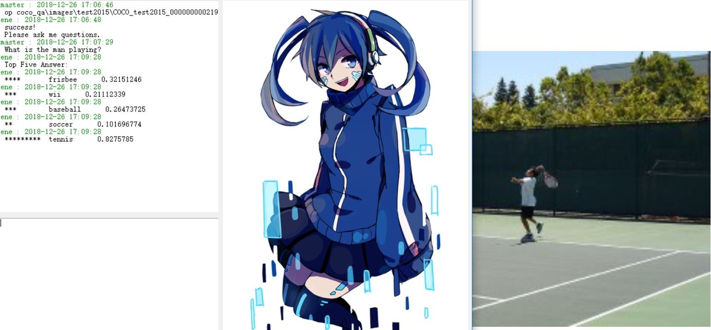

大数据作业报告
人员组成：XXX
组长：XXX

## 新技术在 Visual Question Answering中的应用
### 摘要
- Visual Question Answer (VQA) 是对视觉图像的自然语言问答，作为视觉理解 (Visual Understanding) 的一个研究方向，连接着视觉和语言。问题的格式是给定一张图片，并提出关于这张图片的问题，获得该问题的回答。
	使用了BOW词袋模型和Word To Vector单词矩阵化的技术来分别处理label和输入的单词向量，及LSTM网络和Attention机制，VIS+LSTM网络结构，搭建了VQA问题的新模型。在我们的模型中，拥有3个LSTM网络分别处理：文本，图像，文本和图像。在可视化输出结果中，正确回答在Top5回答中的可能性很高。
- 关键词: BOW     	Word To Vector		LSTM		Attention		VIS+LSTM		VQA 
### 目录 

- 1 问题说明	1
- 1.1 问题背景	1
- 2 问题分析	1
- 3 猜想	1
- 4 模型的建立	1
- 4.1 模型概述	3
- 4.1.1 数据集的使用	3
- 4.2 VGG19模型	3
- 4.2.1 VGG19 效果分析	3
- 4.2.2 VGG19 参数分析	3
- 4.3 LSTM 模型	3
- 4.3.1 LSTM 效果分析	3
- 4.3.2 LSTM 参数分析	3
- 4.4 Word To Vector 模型	3
- 4.4.1 Word To Vector 效果分析	3
- 4.5 综合模型分析	4
- 5 模型的效果	4
- 6 模型的提升	5
- 引用	6

 
### 1 问题说明
#### 1.1 问题背景
Visual Question Answer (VQA) 是对视觉图像的自然语言问答，作为视觉理解 (Visual Understanding) 的一个研究方向，连接着视觉和语言，模型需要在理解图像的基础上，根据具体的问题然后做出回答。
随着深度学习的不断发展，我们对于VQA问题的解答也有了飞跃。从早期的VIS+LSTM模型[1]和它的变种VIS+双向LSTM网络，到目前兴起的attention机制[2]，还有诸如外链知识库和Word To Vector的发展，无疑都大大推动了我们的研究。本文将使用包括但不仅仅是以上的几种思路，设计我们自己的VQA模型，其中的创新之处在于，我们同时运用了多种新技术，使用了在不同维度上的感受器分别感受空间和实体，并将其巧妙地融合在一起。
#### 2 问题分析
	解决VQA问题需要NLP+CV的共同合作才能完成，因此我们的主体框架仍然紧紧围绕视觉感知+自然语言处理的方向。

	其中，我们使用一个训练好的VGG19网络作为视觉感受器，并使用LSTM网络处理我们的问题。在LSTM处理之前，我们会使用Word To Vector的模型，使用维基百科的句子训练词向量，并建立字典，将每个英文单词映射到一个300维的向量空间。

	我们目前拥有的数据集是一个非常大型的数据集COCO-QA，它的训练集有80000多张图片，测试集有80000多张图片，验证集也有40000多张图片，每张图片有数量不等的问题，每个问题有10个回答，并且标注了每个回答的信心程度。
#### 3 猜想
	我们猜想LSTM网络最后一个输出层的结果包含的问题的信息可以很好地生成空间感受器和类别感受器，用于给图像加入attention机制。这个attention我们加载到了图像进入VGG19网络后输出的第一个全连接层前面的那个池化层上。我们希望这两个感受器能够感受到我们想要的物品和空间位置信息。

### 4 模型的建立
#### 4.1 模型概述
	我们的模型结构如下：
	 
[batch_size,224,224,3]的图像数据传入VGG19网络，并从VGG19网络输出卷积池化的结果，即POOL5层的[batch_size,7,7,512]维的数据
[batch_size,7,7,512]维的数据和[512,512]维的可训练权重w_pic和[512,]维的可训练偏置项b_pic进行加权，通过leaky_relu激活函数，得到[batch_size,7,7,512]维的数据A。
我们的问题作为字符串传入我们训练好的word to vector模型，并得到[batch_size,36,300]维的时序向量，其中字符串不足36个单词的话我们会进行padding，但同时我们也会记录问题的真实长度，因此我们的LSTM网络结果不会被padding的零项所影响。
[batch_size,36,300]维的问题向量和[300,300]维的可训练权重w_q和[300,]维的可训练偏置项b_q进行加权，通过leaky_relu激活函数，得到[batch_size,36,300]维的数据B。这个数据会进入LSTM网络训练，设置了0.7的dropout，输出最后一个有效输出层的结果[batch_size,300]维的数据C。这一数据C会被可训练权重和偏置项加权，再通过sigmoid激活函数生成两个分别为[batch_size,7,7]，[batch_size,512]的感受器。
这两个感受器分别在[batch_size,7,7,512]维的数据A上进行卷积，对数据A上各个点有个加权的效果，再把图像输入LSTM网络，设置了0.7的dropout，得到LSTM网络最后一层的有效输出[batch_size,512]的数据D。
数据D经过全连接层得到的300维向量作为我们最后一层LSTM网络的第一个单词，[word_num,300]维度的句子拼接在数据D的后面输入LSTM网络，得到最后一个有效输出层的结果E。
我们把数据E输入全连接层，使用sigmoid输出各个回答的概率。我们的label是使用了基于训练集构建的一个词袋模型。
使用交叉熵计算损失，梯度下降作为优化器。这里由于正例数远小于负例，我们为了防止分类器全输出0，对正例采用了激励系数。
#### 4.1.1 数据集的使用
	使用的是COCO-QA数据集。

	我们把COCO-QA模型的每个问题中，拥有加权得分3以上的回答标记为正例，加权方式：confidence为yes时+1，为maybe时+0.5，统计每个问题所有十个回答。

	WIKI百科生成的Word To Vector模型。

	训练集回答生成的词袋模型。

### 4.2 VGG19模型
#### 4.2.1 VGG19 效果分析
	VGG19最后一个池化层可以反映图像位置信息和特征信息，但无论是从精度还是速度上来说，使用Faster-RCNN网络都要比只使用这个简单的CNN网络的效果要好得多，但我手上没有Faster-RCNN的训练好的参数，训练起来成本又过高，只好使用这个作为替代。
#### 4.2.2 VGG19 参数分析
	在RCNN[3]的文章里，作者提到，CNN网络对图像特征的提取主要在卷积层和池化层，而要使图像更好的拟合训练集，我们需要重新训练全连接层参数。由于我的计算资源不足，所以我不打算使用全连接层参数。在不在新的训练集上对全连接层参数进行微调的情况下，使用最后一个池化层的效果可能会更好。当然，在计算资源不足的情况下，我无法验证。而且最后一个池化层比全连接层更能表现物品的位置信息。

### 4.3 LSTM模型
#### 4.3.1 LSTM 效果分析
	Long Short-Term Memory[4]网络能够对时序流的特征进行一个很好的捕捉，我们利用这个特点，不仅拿它应用在问题语句，更把图像转换成一个空间流矩阵传入LSTM网络，使之对空间问题有个很好的映射。
#### 4.3.2 LSTM 参数分析
	在LSTM层里面使用了0.7的dropout，减小过拟合。

### 4.4 Word To Vector模型
#### 4.4.1 Word To Vector 效果分析
	我们使用了维基百科来训练Word To Vector模型，使我们的文本能够很好的映射到词向量空间。而且这一映射是根据一个三层的网络训练得到的，和其相关词有着特定的联系。

### 4.5 综合模型分析
我们的模型有着仿生的特性，类似于人类视界的感受野，模型对于关注的事物总是看的更“清楚”，即attention机制。有了这个机制，我们便可以根据问题去图像中寻找答案。下面给出了一个例子：
[图片]
这是仅仅训练10000次后的结果，可以看出我们的网络对于图像的依赖程度要大于对文字的依赖程度，这可能是由于我们文字的LSTM网络放在前面，图像的LSTM网络放在后面，反向传播梯度时，发生了轻微的梯度消失。在训练次数较少的情况下，梯度消失现象较为明显。不过我们仍能看出，神经网络已经得到了部分信息。
### 5 模型的效果
由于计算资源不足，这里只给出随机选择的图像可视化结果。
训练了超过100w次后在测试集上的结果：

这个效果令人很满意，它准确的判断出了在打的球类，即网球这个回答的正确率远远大于其他回答。
 
识别出了飞机，不过识别率不是很高。

由于计算资源不足，这个模型并没有跑完整个训练集，但它的效果已经比较优秀了，特别是TOP5ANSWER的正确率，在上面随机抽取的图像上为100%。但误识率过高还是由于我们的神经网络训练的次数过少。
### 6 模型的提升
把VGG19的CNN模型换成Faster-RCNN，并对于本训练集进行一个微调。这样可以增加图像特征提取的精度。
可以根据[5]这篇论文，建立双向attention关系，使用图像和问题的LSTM网络隐藏层，互相进行一个attention，这个有个明显的好处，即增强图像对问题描述的修正：我们可以看出我们的模型的空间感受器有个明显的问题，即只能感受绝对位置，无法感受相对位置。但双向attention后，可以使我们的问题对图像更好的契合，最直观的提升即是拥有了表达相对位置的能力。
以上提升之处建立在拥有更好的显卡训练的基础上，目前我使用的是一块GTX1050的显卡（在个人笔记本上），计算资源不足。
### 引用
[1] Ren M , Kiros R , Zemel R . Exploring Models and Data for Image Question Answering[C]// NIPS. MIT Press, 2015.
[2] Anderson P, He X, Buehler C, et al. Bottom-Up and Top-Down Attention for Image Captioning and Visual Question Answering[J]. 2017.
[3] Girshick R , Donahue J , Darrell T , et al. Rich Feature Hierarchies for Accurate Object Detection and Semantic Segmentation[C]// 2014 IEEE Conference on Computer Vision and Pattern Recognition (CVPR). IEEE Computer Society, 2014.
[4] Hochreiter S, Schmidhuber J. Long Short-Term Memory[J]. Neural Computation, 1997, 9(8):1735-1780.
[5] Singh J , Ying V , Nutkiewicz A . Attention on Attention: Architectures for Visual Question Answering (VQA)[J]. 2018.
